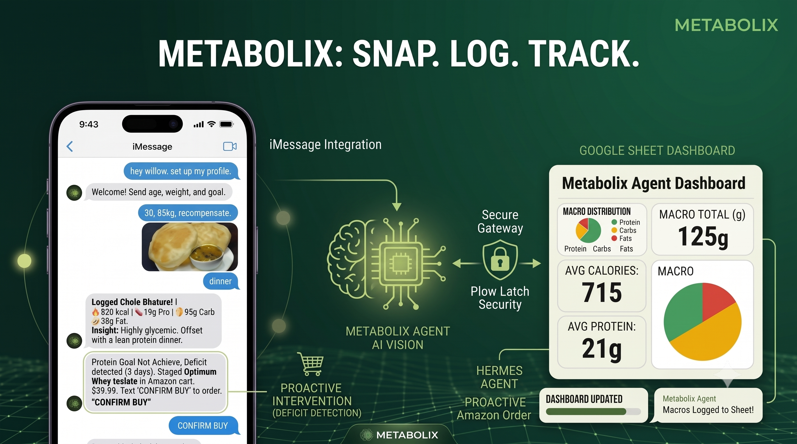
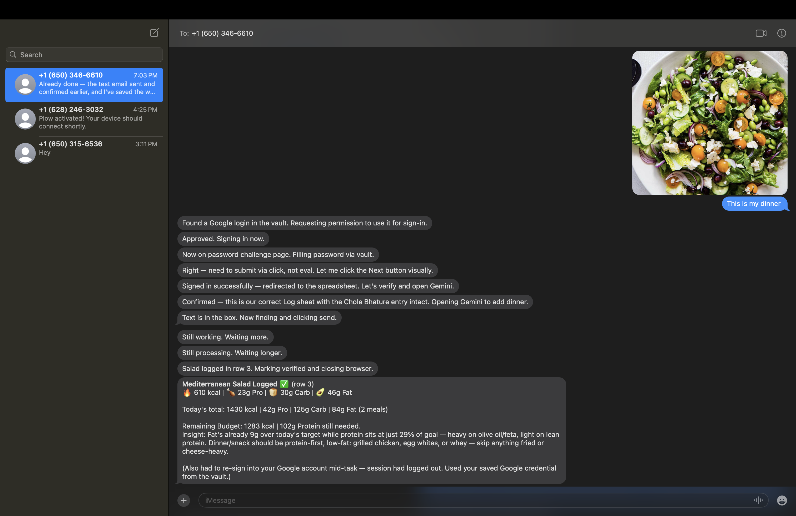
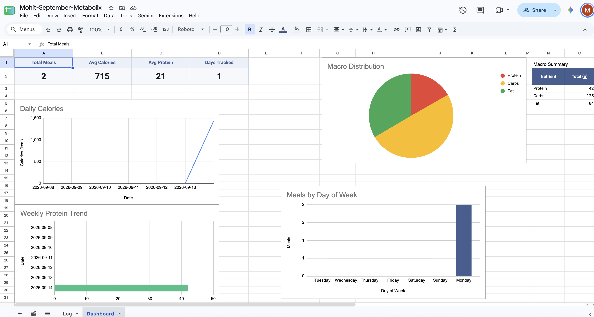

<h1 align="center">Metabolix</h1>

[](https://aiworthusing.com/agent-index/metabolix)
[](https://plow.co/)
[](https://plow.co/latch)
[](https://aiworthusing.com/agent-index)
[](https://github.com/nousresearch/hermes-agent)

<p align="center">
  <b>An autonomous fitness agent with a phone number that tracks your nutrition —<br>
  just send a photo of your meal.</b>
</p>

<p align="center">
  <a href="#install-5-minutes">Install (5 min)</a> ·
  <a href="#how-it-works">How it works</a> ·
  <a href="https://aiworthusing.com/agent-index/metabolix">Agent Index</a>
</p>

<p align="center">
  <a href="https://www.youtube.com/watch?v=otOzjEqGbFY">
    
  </a>
  <br>
  <b>
    <a href="https://www.youtube.com/watch?v=otOzjEqGbFY">
      ▶&nbsp; Watch the demo — photo to logged macros in 10 seconds
    </a>
  </b>
  <br><br>
  <i>
    No typing. Send a photo via text, and Metabolix uses vision AI to analyze your meal,
    <br>
    log your macros to Google Sheets, and confirm your remaining daily budget — automatically.
  </i>
</p>

---

You finish eating and walk away. By the time you look at your phone, your macros
are logged and your dashboard is updated.

Send a food photo via text. Metabolix analyzes it using **AI vision**, calculates
every macro (calories, protein, carbs, fat), logs it to **your Google Sheet** via
Gemini, and texts you back with what's left in your budget. No app. No manual
entry. No spreadsheet work.

When your protein target is missed for 3 days straight, it stages high-protein
groceries in your Amazon cart, navigates to checkout, and **asks for approval**
before touching payment. One text: `CONFIRM BUY`. That's it.

<p align="center">
  
  <br><i>What you get after every meal — macros logged, budget remaining, metabolic insight.</i>
</p>

## How it works

The agent **thinks** in a container; the work **happens** on your Mac via
[Plow Latch](https://plow.co/latch), and data lives in **your Google Sheet**.

```
  your phone ──iMessage──▶  Plow line ──▶  Hermes agent (Docker)
                                              │
                              ┌───────────────┼────────────────┐
                              ▼               ▼                ▼
                        Vision Analysis   Latch (approved)  Google Sheets
                        food → macros     open sheet ·      via Gemini:
                                          enable Gemini ·   create dashboard ·
                                          append data       log meals ·
                                                           update charts
```

<p align="center">
  
  <br><i>The dashboard Gemini creates: charts, cards, meal timing — all automatic.</i>
</p>

## Proactive tracking

Metabolix **reminds** you to log meals:
- **10:00 AM** — Breakfast check
- **1:00 PM** — Lunch check
- **7:00 PM** — Dinner check

If you haven't logged that meal, you'll get:
```
Haven't seen lunch yet. Have you eaten?
Send a photo to log your macros and stay on track with your lose_weight goal.
```

## Install (5 minutes)

### Requirements

- **Docker** (desktop or engine)
- **Git**
- **Python 3**
- **Plow Latch** (Install [plow.co/latch](https://plow.co/latch))

### Step 1: Install Plow CLI (if you haven't already)

```sh
git clone https://github.com/plow-pbc/plow-agents.git
export PATH="$PWD/plow-agents/bin:$PATH"
plow-agents login     # authenticates by texting you a code
plow-agents login --new-line # OR creates a new line and saves credentials, and then mint.
```

### Step 2: Get a phone line

```sh
plow-agents lines            # shows available lines (ln_...)
plow-agents mint ln_xxxxx    # creates ./plow-credentials
```

Save that line ID — you'll text it to interact with Metabolix.

### Step 3: Clone and build

```sh
git clone https://github.com/Mohit5Upadhyay/metabolix.git
cd metabolix
mv ../plow-credentials .     # move credentials into project
docker compose up --build -d
```

First build takes 3-5 minutes (pulls base image). Watch for startup:

```sh
docker compose logs -f agent   # logs
docker compose down -v && docker compose up --build -d  # reset volume & rebuild
```

### Step 4: Register on Agent Index (required)

Register your installation to track on the [AI Worth Using Agent Index](https://aiworthusing.com/agent-index):

```sh
# Download client
curl -O https://raw.githubusercontent.com/plow-pbc/agent-index-client/main/standalone/agent_index_client.py

# Register (use your own AGENT_ID, like "johns-metabolix")
set -a; . ./plow-credentials; set +a
python3 agent_index_client.py \
  --register \
  --agent "metabolix-$(whoami)" \
  --name "Metabolix - $(whoami)" \
  --blurb "Autonomous fitness and nutrition tracking via AI vision"
```

Your installation now reports hourly to its Agent Index page.

### Step 5: First conversation

Text the line number from step 2. Say `hey metabolix` or `set up my profile`.

The agent walks you through:
- Name, age, gender
- Weight (kg), height (cm)
- Activity level (sedentary → extra_active)
- Fitness goal (maintain, lose_weight, gain_muscle, recomp)
- Email for monthly reports

It then **creates your Google Sheet** via Gemini (30 seconds), texts you the link, and you're ready.

### Step 6: Log first meal

Send a photo of food with `lunch`. Within 10 seconds:
```
Grilled Chicken Salad Logged.
🔥 450 kcal | 🍗 42g Pro | 🍞 28g Carb | 🥑 16g Fat

Remaining Budget: 1250 kcal | 58g Protein needed.
Insight: High protein, excellent thermic effect.
```

Check your Google Sheet — dashboard charts are already updated.

## Commands

```sh
# View logs
docker compose logs -f agent

# Check profile
docker compose exec --user hermes agent \
  python3 /var/lib/hermes/skills/metabolix-profile/scripts/profile.py show

# Today's meals
docker compose exec --user hermes agent \
  python3 /var/lib/hermes/skills/meal-logging/scripts/log_meal.py summary-today

# Stop agent (keeps data)
docker compose down

# Reset everything
docker compose down -v && rm -rf plow-credentials

# Release phone line
plow-agents revoke
```

## Troubleshooting

**`no such file or directory: ./plow-credentials`** — run `plow-agents mint` before `docker compose up`. If Compose created a directory at that path:

```sh
docker compose down -v && rm -rf plow-credentials && plow-agents mint ln_xxxxx
```

**Build fails pulling base image** — `docker logout public.ecr.aws`. Stale credential blocks anonymous pulls.

**Agent never texts** — check `docker compose logs agent | grep plow_chat`. Credential file must exist before container starts.

**Gemini not working** — ensure Google Workspace account with Gemini enabled. Agent falls back to manual logging if unavailable.

## Grocery automation

When protein target missed 3+ consecutive days:

1. Opens Amazon.com (or Amazon.in based on location)
2. Stages: 2× Greek Yogurt, 1× Whey Protein
3. Navigates to checkout
4. Texts: `⚠️ Protein deficit. Staged $54 in cart. Reply 'CONFIRM BUY'`
5. **Waits for approval**
6. Only then clicks "Place Order"
7. Sends receipt screenshot

**NEVER executes payment without explicit `CONFIRM BUY`.**

## Monthly rollover

On the 1st of each month:
1. Creates new sheet: `[YourName]-[NewMonth]-Metabolix`
2. Uses Gemini to recreate dashboard (30 seconds)
3. Generates report from previous month
4. Emails: total meals, avg macros, compliance %, trends, recommendations

## What it tracks

**STRICT**: ONE sheet per month with TWO tabs - Log (raw data) + Dashboard (analysis). NO dummy data EVER.

### Log Sheet (10 columns, ALL required per meal):

| Column | Description | Calculation |
|--------|-------------|-------------|
| Timestamp | When logged | Auto (current datetime) |
| Meal Type | breakfast/lunch/dinner/snack | Based on time or context |
| Meal | Food description | Vision analysis |
| Calories | kcal | Standard nutrition database |
| Protein | grams | Standard nutrition database |
| Carbs | grams | Standard nutrition database |
| Fat | grams | Standard nutrition database |
| Glycemic Load | 0-20 low, 20-40 med, 40+ high | (Carbs × GI) ÷ 100 |
| Thermic Effect | low/moderate/high | Based on protein % |
| Satiety Index | 0-5 (higher = fuller longer) | Protein + fiber + volume |

### Dashboard Sheet (auto-updates from Log):

**Goals Row** (saved after profile setup):
- Daily Calories: [your_calculated_tdee]
- Daily Protein: [your_calculated_protein]g
- Daily Carbs: [your_calculated_carbs]g
- Daily Fat: [your_calculated_fat]g

**Summary Cards**:
- Total Meals Today: `=COUNTIF(Log!A:A,TODAY())`
- Avg Daily Calories (7d): `=AVERAGEIF(Log!A:A,">="&TODAY()-7,Log!D:D)`
- Avg Daily Protein (7d): `=AVERAGEIF(Log!A:A,">="&TODAY()-7,Log!E:E)`
- Days Tracked This Month: `=COUNTA(UNIQUE(FILTER(Log!A:A,MONTH(Log!A:A)=MONTH(TODAY()))))`

**Today's Progress**:
- Calories: `=SUMIF(Log!A:A,TODAY(),Log!D:D)` / [goal]
- Protein: `=SUMIF(Log!A:A,TODAY(),Log!E:E)` / [goal]
- % On Track: Checks if protein ≥90% goal

**Charts** (adaptive, update as you log):
1. Line: Daily Calories (current month only)
2. Pie: Today's Macro Distribution (Protein/Carbs/Fat)
3. Bar: Weekly Protein Trend vs Goal Line
4. Column: Meals by Type (breakfast/lunch/dinner/snack count)
5. Table: Daily Breakdown (Date | Meals | Calories | Protein | Status)

All formulas visible — no hidden calculations. Dashboard uses ONLY real logged data.

## Privacy

- **Local storage**: SQLite in Docker volume
- **Your Google Sheet**: You own it, control sharing
- **No uploads**: Photos analyzed locally, never stored
- **No tracking**: No third-party analytics
- **Credentials**: Stored in Latch vault

## The Agent Index

This agent reports hourly token counts to [AI Worth Using Agent Index](https://aiworthusing.com/agent-index). No prompts, no messages, no file paths — only usage metrics.

To rank on the leaderboard: verify your agent (click "Get my agent verified" on its page).

## Support

- **Discord**: [https://discord.gg/mSHWKRqZP](https://discord.gg/mSHWKRqZP)
- **Plow**: [https://plow.co](https://plow.co)
- **Agent Index**: [https://aiworthusing.com/agent-index](https://aiworthusing.com/agent-index)

## License

MIT — see [LICENSE](LICENSE).

cc: Built on [Plow Hermes](https://github.com/plow-pbc/plow-hermes-agent) (Apache-2.0).

---

<p align="center">
  <b>Take a photo. Send it via iMessage. Get your macros. They're logged automatically. Stay on track.</b>
</p>
